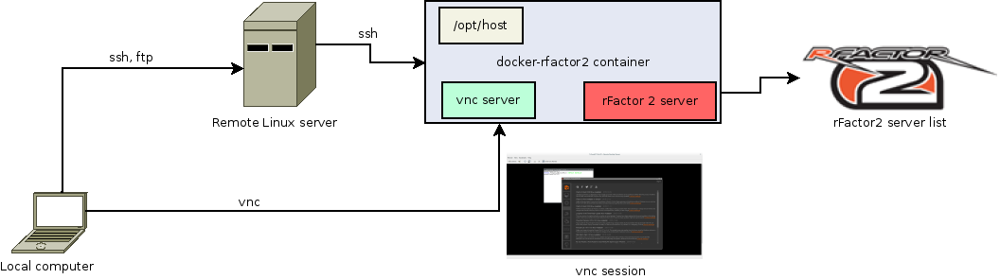

docker-rfactor2
===============

Rfactor2 server inside a docker container. This allows you to run a rFactor 2 server in a Linux vps which is cheaper than a Windows one.

**Work in progress. Please test.**


##Prerequisites
- Linux box. Dedicated or Vps (KVM). (Recommended Vps provider: http://www.digitalocean.com).
- 512 MB RAM (optional 512 MB vswap).
- A linux distribution where docker can be installed. (Recommended: ubuntu 14.04) 

##Components:
- Remote server: VPS or dedicated server. It must be able to be accesed using ssh.
- Docker-rFactor2 container: The container that runs inside the remote server and where rfactor 2 is installed. It's accesed using vnc.
- Client computer: local computer that connects to remote server (using ssh) and docker-rfactor2 container (using vnc).

##Installation
These instructions are for an ubuntu 14.04 host.

###1. Install docker
Install docker on remote server.
https://docs.docker.com/engine/installation/ubuntulinux/

###2. Build container
On remote server execute:
```
$ git clone https://github.com/jeysonmc/docker-rfactor2.git
$ cd docker-rfactor2
$ docker build -t docker/rfactor2 .
```
This will take several minutes while it downloads all the packages and the rFactor lite installer (current build: 1036).

###3. Run container
Start container on remote server:
```
$ CONTAINER_ID=$(docker run -d -p 64297:64297 -p 64297:64297/udp -p 54297:54297 -p 54297:54297/udp -v $HOME:/opt/host -P docker/rfactor2)
$ docker port $CONTAINER_ID
```
Anotate the host ports (the ones at the right).

###4. Start vnc server
Connect to rfactor2 container using ssh from remote server (using the existing ssh session) and execute:
```
$ ssh docker@localhost -p [HOSTPORTSSH] "sh -c './startvnc.sh  > /dev/null 2>&1 &'"
```
Replace [HOSTPORTSSH] with the asigned host port for container's ssh port 22. This will start a vnc server inside the container. Use docker as password.


###5. Connect to server using vnc
On client computer connect to host using your prefered vnc client. Use the vps external ip and HOSTPORTVNC (the one asigned to container port 5900).
If all goes well a remote desktop (jwm) will be shown and a xterm console will appear.

###6. Install rFactor 2 in container
In the vnc session use the xterm console: 
```
$ wine rFactor2_LiteBuild_1036.exe
```
Install everything but DirectX libraries.

Test the rFactor2 installation in the container (using vnc session). The rFactor 2 launcher should appear.
```
$ ./runrf2.sh
```

###7. Commit the changes to the container
Close the vnc session (disconnect).

On the host server stop the container 
```
$ docker stop  $CONTAINER_ID
$ docker commit $CONTAINER_ID docker/rfactor2
```
Restart container (repeat step 3 and 4). Remember to anotate the ports.

##Usage
###Upload a Vmod (rfmod)
Create rfmod file on local computer and upload it to the home directory in remote server (I recommend using Filezilla client).
That home directory is available in the container at /opt/host. So, in the container, using a vnc session you can copy the file to the rFactor2 directory.

```
$ cp /opt/host/FILE.rfmod /home/docker/rFactor2/Packages
```

Run the rFactor2 launcher and install it.

```
$ ./runrf2.sh
```

Optional: commit the changes to the container and restart (step 7).

###Start a rFactor2 server host.
On the container, using a vnc session (step 5) run the rFactor2 launcher and click on host (you can close the launcher after that to save memory).
```
$ ./runrf2.sh
```
You can close the vnc session if you wish. The rfactor2 server will continue to operate. You can still relogin using vnc to check and administrate the session.

**Beware of memory usage (check it with free command) and bandwidth.**

###Restart rFactor2 container.
If you need to restart the container login to the remote server using ssh, stop the container and do steps 3 and 4.

```
$ docker ps
$ docker stop [CONTAINERID]
```
docker ps shows running containers and its id. Use the proper id in docker stop.

CREDITS
=======
Based on rogaha/docker-desktop and suchja/wine
Author: Jeyson Molina pilotojason at gmail dot com
